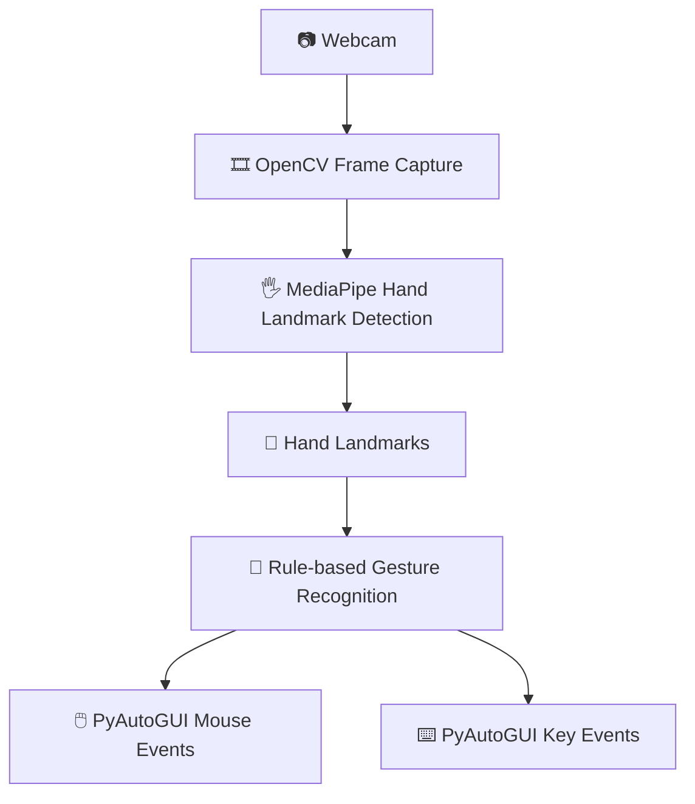

<div align="center">

# 🖐️ Virtual Mouse & Keyboard

### Control your PC with hand gestures — powered by real-time computer vision.

A webcam-based Human-Computer Interaction system that tracks your hand with
**MediaPipe**, recognizes gestures with **OpenCV**, and drives your **real OS
mouse and keyboard** with **PyAutoGUI**.

[](https://www.python.org/)
[](https://opencv.org/)
[](https://developers.google.com/mediapipe)
[](https://pyautogui.readthedocs.io/)
[](https://developer.mozilla.org/en-US/docs/Web/JavaScript)
[](https://abithrekchneanbu.github.io/virtual-mouse-keyboard/)

**[🚀 Live Demo](https://abithrekchneanbu.github.io/virtual-mouse-keyboard/) · [💻 Source Code](https://github.com/Abithrekchneanbu/virtual-mouse-keyboard)**

</div>

---

## 🚀 Live Demo / Working Preview

<!-- Add a real screenshot or GIF of main.py running here -->
<!-- Add a real screenshot or GIF of the browser demo here -->

No screenshot or recording is committed to the repository yet, so the space
above is left as a placeholder rather than a fake demo image — drop a real
capture of `main.py` in action (webcam feed + hand skeleton + cursor/keyboard
overlay) in here once you have one.

In the meantime, you can see it working for real, right now, in the browser:

**👉 [abithrekchneanbu.github.io/virtual-mouse-keyboard](https://abithrekchneanbu.github.io/virtual-mouse-keyboard/)**

1. Open the live demo link above
2. Allow webcam permission
3. Choose **🖱️ Virtual Mouse** or **⌨️ Virtual Keyboard**
4. Show your hand to the camera and perform the on-screen gesture instructions

> The browser demo runs entirely inside the page — it shows an on-page virtual
> cursor/keyboard and cannot control your real OS mouse or keyboard, due to
> browser security restrictions. The Python app (`main.py`) *can*, since it
> runs locally with full OS access.

---

## 🖱️ Virtual Mouse

Move your index finger in front of the webcam to move the cursor, and use a
pinch gesture (thumb + index finger together) to click — the same interaction
model used in both the Python app and the browser demo.

| Gesture | Action |
|---|---|
| ☝️ Index finger raised | Move the cursor |
| 🤏 Thumb + index finger pinch | Click |

---

## ⌨️ Virtual Keyboard

An on-screen keyboard is rendered over the webcam feed. Point at a key with
your index finger to select it, then pinch your thumb and index finger
together to "press" it.

| Gesture | Action |
|---|---|
| ☝️ Point at a key | Hover / highlight that key |
| 🤏 Thumb + index finger pinch | Press the highlighted key |

---

## ✋ Hand Gesture Recognition

Gestures are computed from **MediaPipe hand landmarks** using simple,
rule-based geometry rather than a trained classifier:

- **Fingertip position** (e.g. the index fingertip) is mapped to screen/cursor
  coordinates for movement and key-hovering.
- **Distance between two landmarks** (thumb tip and index fingertip) is
  measured every frame; when that distance drops below a threshold, it's
  treated as a pinch and triggers a click or key-press.

No accuracy percentages or benchmark numbers are published for this project —
performance depends heavily on lighting, camera quality, and hand distance
from the camera.

---

## 🧠 How It Works



1. **Webcam** — OpenCV captures live video frames
2. **Hand Detection** — MediaPipe locates the hand and its landmarks per frame
3. **Gesture Recognition** — fingertip positions and distances are compared
   against thresholds to detect movement vs. pinch gestures
4. **Action** — PyAutoGUI translates a recognized gesture into a real mouse
   move/click or keyboard key press on your OS

A parallel, browser-only version of this same pipeline (webcam → MediaPipe →
gesture → on-page action) powers the [live GitHub Pages demo](https://abithrekchneanbu.github.io/virtual-mouse-keyboard/), written in JavaScript instead of Python.

---

## 🛠️ Technologies Used

| Category | Technology |
|---|---|
| 🧠 Computer Vision | OpenCV, MediaPipe |
| 🐍 Language (desktop) | Python |
| 🖱️ Input Automation | PyAutoGUI |
| 🌐 Language (web demo) | JavaScript, HTML5, CSS3 |
| 🚀 Deployment | Git, GitHub, GitHub Pages |

---

## 📁 Project Structure

```
virtual-mouse-keyboard/
│
├── main.py                  # Main entry point — hand-gesture mouse & keyboard control
├── hand_landmarker.task      # MediaPipe hand-landmark model file
├── requirements.txt          # Python dependencies
├── .python-version           # Pinned local Python version
└── README.md
```

*(The [live demo](https://abithrekchneanbu.github.io/virtual-mouse-keyboard/) is a separate, browser-based HTML/JS implementation hosted via GitHub Pages.)*

---

## ⚙️ Installation & Running

```bash
# 1. Clone the repository
git clone https://github.com/Abithrekchneanbu/virtual-mouse-keyboard.git

# 2. Move into the project folder
cd virtual-mouse-keyboard

# 3. Create and activate a virtual environment (Windows)
python -m venv venv
venv\Scripts\activate

# 4. Install dependencies
pip install -r requirements.txt

# 5. Run the application
python main.py
```

Grant camera access when your OS prompts you. Check the repository's
`.python-version` file for the exact Python version this project targets —
MediaPipe requires a compatible Python 3.x release.

---

## 🌐 Web Demo

No installation needed — runs directly in your browser:

**👉 [abithrekchneanbu.github.io/virtual-mouse-keyboard](https://abithrekchneanbu.github.io/virtual-mouse-keyboard/)**

Open the link, allow camera access, and pick Virtual Mouse or Virtual
Keyboard to try it instantly.

---

## ⚠️ Limitations

- Sensitive to lighting conditions
- Accuracy drops with hand occlusion or fast hand movement
- Depends on webcam quality and frame rate
- Pinch/click gesture thresholds are fixed rather than adaptive
- The browser demo cannot control anything outside the page, by design (browser security)

---

## 🚀 Future Enhancements

- [ ] Scroll gestures
- [ ] Drag & drop support
- [ ] Two-hand interaction
- [ ] Configurable/custom gestures
- [ ] Adjustable sensitivity settings
- [ ] Improved cursor smoothing

---

## 👨‍💻 Author

**Abithrekchneanbu**

GitHub: https://github.com/Abithrekchneanbu
