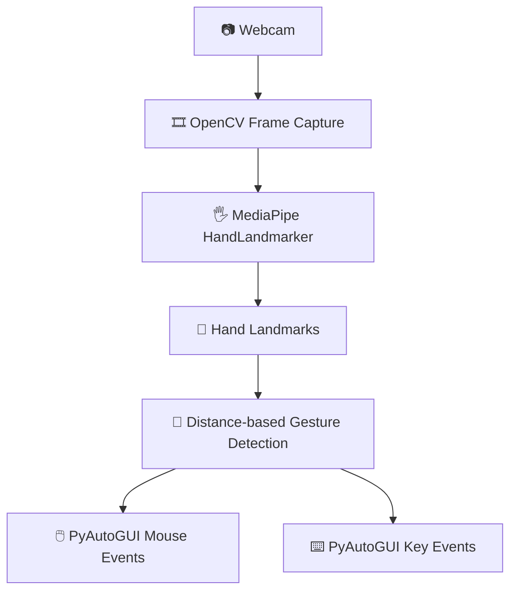

<div align="center">

# 🖐️ Virtual Mouse & Keyboard

### Turn your webcam into a touch-free human-computer interface.

Control a virtual mouse and a virtual keyboard using real-time hand tracking and gesture
recognition — no physical hardware required, just a webcam and your hand.

[](https://www.python.org/)
[](https://opencv.org/)
[](https://developers.google.com/mediapipe)
[](https://streamlit.io/)
[](https://pyautogui.readthedocs.io/)
[](https://developer.mozilla.org/en-US/docs/Web/JavaScript)
[](https://abithrekchneanbu.github.io/virtual-mouse-keyboard/)

**[🚀 Live Demo](https://abithrekchneanbu.github.io/virtual-mouse-keyboard/) · [💻 GitHub Repository](https://github.com/Abithrekchneanbu/virtual-mouse-keyboard)**

</div>

---

## 🚀 Try It Live

The fastest way to see the project in action — no installation needed.

**👉 [abithrekchneanbu.github.io/virtual-mouse-keyboard](https://abithrekchneanbu.github.io/virtual-mouse-keyboard/)**

1. Open the live demo link above
2. Allow webcam permission when prompted
3. Choose **🖱️ Virtual Mouse** or **⌨️ Virtual Keyboard**
4. Show your hand to the camera
5. Perform the gesture shown for that mode
6. Watch the on-screen cursor / keyboard respond in real time

> **Note:** the browser demo runs entirely *inside the page*. Because of browser
> security restrictions, it moves an on-screen virtual cursor and shows typed
> characters in a text panel — it cannot move your actual OS mouse pointer or type
> into other applications. For that, see the [Python desktop application](#-desktop-application-apppy) below.

---

## 🧠 Project Overview

This project is a real-time **Human-Computer Interaction (HCI)** system. It reads
frames from a webcam, detects a hand using **MediaPipe's hand-landmark model**, and
converts finger positions and distances into gestures using **rule-based logic**
(distance/position thresholds) — not a trained ML classifier.

```
📷 Webcam → 🎞️ Video Frame → 🖐️ Hand Detection (MediaPipe)
        → 📍 Hand Landmarks → 🤏 Gesture Recognition (rule-based)
        → 🖱️ Mouse Action / ⌨️ Keyboard Action
```

The repository contains **two separate implementations** of this pipeline:

| Implementation | Where it runs | Controls |
|---|---|---|
| 🐍 **Python desktop app** (`app.py`) | Locally, via Streamlit | The real OS mouse & keyboard (via PyAutoGUI) |
| 🌐 **Browser demo** (GitHub Pages) | In any modern browser | An on-page virtual cursor/keyboard only |

---

## 🎬 See It In Action

<!-- Add virtual mouse demo GIF/screenshot here -->
<!-- Add virtual keyboard demo GIF/screenshot here -->
<!-- Add browser demo GIF/screenshot here -->

The repository doesn't currently include screenshots or GIFs — the placeholders
above mark where they'd go. In the meantime, the [live demo](https://abithrekchneanbu.github.io/virtual-mouse-keyboard/)
is the quickest way to see it running.

---

## ✨ Feature Showcase

| 🖱️ Virtual Mouse | ⌨️ Virtual Keyboard |
|---|---|
| Index-finger cursor movement | Point-to-hover key selection |
| Pinch (thumb + index) for right-click | Pinch (thumb + index) to type a key |
| Two-finger (index + middle) left click | On-screen keyboard highlighting |
| Real-time hand skeleton overlay | Live "typed text" preview |

Also implemented across both modes:

- 📷 **Real-time webcam-based hand tracking**
- 🌐 **Browser-based demo** — no install required
- ⚡ **Live gesture and cursor feedback** on screen

---

## 🖥️ Desktop Application (`app.py`)

The desktop app is a single **Streamlit** dashboard (`app.py`) that combines the
mouse and keyboard controller in one interface, styled as a dark, terminal-inspired
UI with Start/Stop and Mode-switch controls.

**Pipeline used in `app.py`:**

- Webcam capture via OpenCV (`cv2.VideoCapture`)
- Hand detection via MediaPipe's Tasks-Vision `HandLandmarker`, using the bundled
  `hand_landmarker.task` model (downloaded automatically on first run if missing)
- Landmark extraction (fingertip and joint coordinates)
- Distance-based gesture detection between fingertips
- Real OS-level mouse/keyboard events dispatched via **PyAutoGUI**



### 🖱️ Mouse Mode

| Gesture | Condition | Action |
|---|---|---|
| ☝️ Index finger up, middle finger down | — | Move cursor (smoothed, mapped to screen size) |
| ✌️ Index + middle fingers up, tips close (< 40px) | click cooldown elapsed | Left click |
| 🤏 Thumb close to index while index + middle are up (< 30px) | click cooldown elapsed | Right click |

### ⌨️ Keyboard Mode

An on-screen keyboard is drawn directly on the video feed:

```
Q W E R T Y U I O P
A S D F G H J K L ;
Z X C V B N M , . /
      SPACE    BACK
```

| Gesture | Action |
|---|---|
| ☝️ Point index finger at a key | Highlights ("hovers") that key |
| 🤏 Pinch thumb + index (< 35px) while hovering a key | Presses that key — sends a real keystroke via PyAutoGUI and appends it to the on-screen typed-text log |

A short cooldown (≈0.4s) between key presses prevents accidental repeats.

<details>
<summary>💡 About <code>virtual_mouse.py</code> and <code>virtual_keyboard.py</code></summary>

The repository also includes `virtual_mouse.py` and `virtual_keyboard.py` as
separate files alongside `app.py`. `app.py` is the actively maintained, combined
Streamlit entry point described above — check those files directly in the
repository for their current implementation details.

</details>

---

## 🌐 Browser Demo

The [live demo](https://abithrekchneanbu.github.io/virtual-mouse-keyboard/) is a
self-contained HTML/JavaScript page that also uses MediaPipe for hand tracking,
entirely client-side.

- **Virtual Mouse tab** — move your index finger to move a red on-page cursor;
  pinch thumb + index together to "click"
- **Virtual Keyboard tab** — point your index finger at an on-page key, then pinch
  thumb + index to select/type it (shown in a text panel on the page)

Because it runs inside the browser sandbox, it **cannot** move your real OS cursor
or send keystrokes to other applications — it's a self-contained interactive
demonstration of the same tracking pipeline.

---

## 🖥️ Desktop vs 🌐 Browser Demo

| Capability | 🐍 Python Desktop (`app.py`) | 🌐 Browser Demo |
|---|:---:|:---:|
| Webcam access | ✅ | ✅ |
| Hand tracking (MediaPipe) | ✅ | ✅ |
| Gesture recognition | ✅ | ✅ |
| On-screen / on-page cursor | ✅ | ✅ |
| **Controls real OS mouse** | ✅ (via PyAutoGUI) | ❌ (browser sandbox) |
| **Controls real OS keyboard** | ✅ (via PyAutoGUI) | ❌ (browser sandbox) |
| Installation required | ✅ | ❌ |

---

## 🧰 Technology Stack

<table>
<tr><td>

**🧠 Computer Vision**
- OpenCV
- MediaPipe

</td><td>

**🐍 Languages**
- Python
- JavaScript
- HTML5 / CSS3

</td></tr>
<tr><td>

**🖥️ Interface**
- Streamlit (desktop dashboard)

</td><td>

**🖱️ Input Automation**
- PyAutoGUI

</td></tr>
<tr><td>

**🚀 Deployment**
- Git / GitHub
- GitHub Pages

</td><td></td></tr>
</table>

---

## 📁 Project Structure

```
virtual-mouse-keyboard/
│
├── app.py                  # Streamlit desktop app — combined Virtual Mouse + Keyboard
├── virtual_mouse.py         # Additional mouse-control script
├── virtual_keyboard.py      # Additional keyboard-control script
├── hand_landmarker.task     # MediaPipe hand-landmark model file
├── requirements.txt         # Python dependencies
├── .python-version          # Pinned local Python version
└── README.md
```

*(A GitHub Pages–hosted HTML/JS page powers the [live demo](https://abithrekchneanbu.github.io/virtual-mouse-keyboard/); its exact source path isn't part of this listing.)*

---

## ⚙️ Installation

```bash
# 1. Clone the repository
git clone https://github.com/Abithrekchneanbu/virtual-mouse-keyboard.git

# 2. Move into the project folder
cd virtual-mouse-keyboard

# 3. Create a virtual environment
python -m venv venv

# 4. Activate it (Windows)
venv\Scripts\activate

# 5. Install dependencies
pip install -r requirements.txt
```

> Check the repository's `.python-version` file for the exact Python version this
> project was developed against — MediaPipe generally requires a specific,
> reasonably recent Python 3.x release.

---

## ▶️ Running the Desktop Application

```bash
streamlit run app.py
```

This opens a local dashboard in your browser with **🖱️ Mouse Mode** / **⌨️ Keyboard Mode**
buttons and **▶️ Start** / **⏹️ Stop** controls. Grant camera permission when your OS prompts you.

---

## 🌍 Running the Web Demo

**Online (recommended):**
https://abithrekchneanbu.github.io/virtual-mouse-keyboard/

Just open the link and allow camera access in your browser — nothing to install.

---

## 🔒 Privacy & Security

- Webcam access is required for both the desktop app and the browser demo.
- In the browser demo, camera access is controlled entirely by the browser and the
  video never needs to leave the page.
- The desktop app processes video locally via OpenCV/MediaPipe.
- Nothing in the reviewed code uploads, stores, or transmits webcam footage.

---

## 🎯 Use Cases

- Touch-free human-computer interaction
- Computer vision / gesture-recognition learning and coursework
- Experimental or accessibility-oriented input interfaces
- Demonstrating real-time hand tracking pipelines

---

## ⚠️ Limitations

- Sensitive to lighting conditions
- Accuracy drops with hand occlusion or fast hand movement
- Depends on webcam quality and frame rate
- Gesture thresholds (pinch/click distances) are fixed rather than adaptive
- The browser demo cannot control anything outside the page, by design

---

## 🗺️ Roadmap

**Phase 1 — Done**
- [x] Virtual Mouse (desktop)
- [x] Virtual Keyboard (desktop)
- [x] Real-time hand tracking
- [x] Browser-based demo

**Phase 2 — Planned**
- [ ] Scroll gestures
- [ ] Drag & drop
- [ ] Two-hand interaction

**Phase 3 — Planned**
- [ ] Custom/configurable gestures
- [ ] Adjustable sensitivity settings
- [ ] Improved cursor smoothing

---

## 🧪 Manual Testing Checklist

No automated test suite is included in the repository. Suggested manual checks:

- [ ] Good lighting conditions
- [ ] Low-light conditions
- [ ] Hand fully inside the camera frame
- [ ] Hand partially out of frame
- [ ] Mouse mode: move, left-click, right-click
- [ ] Keyboard mode: hover + pinch-to-type on several keys
- [ ] Fast hand movement
- [ ] Switching between Mouse Mode and Keyboard Mode mid-session

---

## 💡 Engineering Highlights & What This Demonstrates

- Real-time webcam video processing with OpenCV
- Hand landmark detection with MediaPipe's Tasks-Vision API
- Rule-based (distance/position threshold) gesture recognition
- OS-level input automation with PyAutoGUI
- A Streamlit-based interactive control dashboard
- A parallel, dependency-free browser implementation using client-side MediaPipe
- Static site deployment via GitHub Pages

---

## 👩‍💻 Author

**Abithrekchneanbu**

🎓 B.Tech — Information Science and Engineering
💻 Python • Computer Vision • Web Development

🔗 GitHub: [github.com/Abithrekchneanbu](https://github.com/Abithrekchneanbu)
